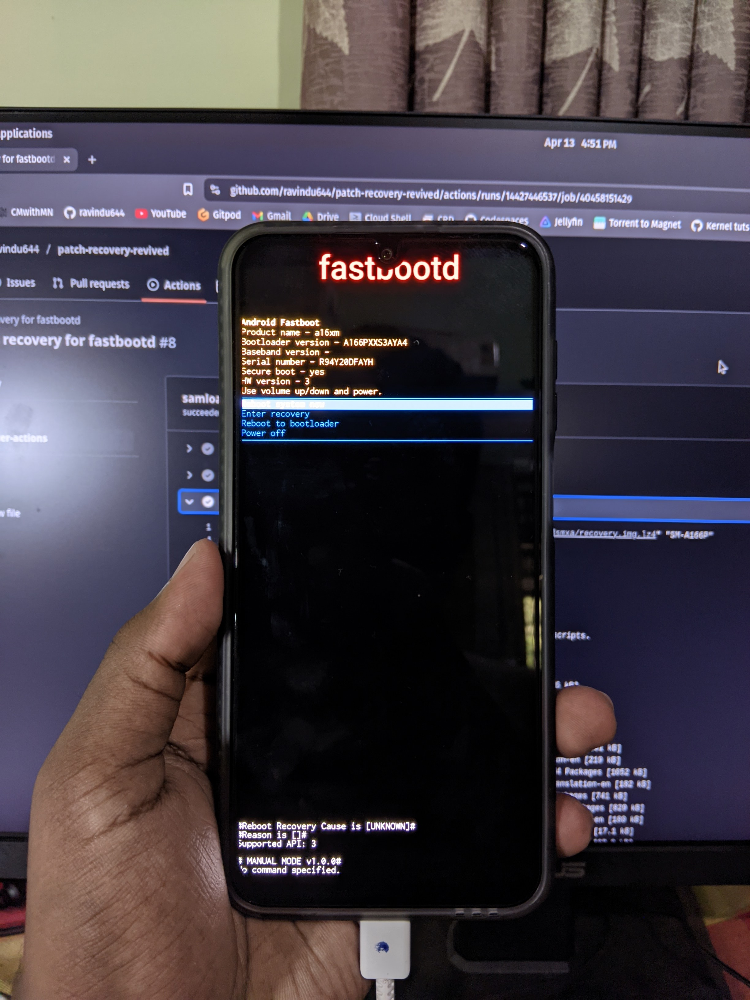

# Patch-Recovery-Revived

The only working `patch-recovery` tool that ever lived to patch Samsung's recovery images to enable **fastbootd mode**.

<details>
  <summary>Click to view image</summary>

  

</details>

## Features

- Supports `.img`, `.lz4`, and `.zip` formats as input.
- Supports both `recovery` and `vendor_boot` images.
- Automatically downloads and processes recovery images from a provided URL or local path.
- Hex-patches the recovery binary to enable **fastbootd** mode.
- Creates an ODIN-flashable `.tar` file for easy flashing.

Notes:

- All the hex patches are located in [this database file](./hex-patches.sh).  
- On Samsung devices, `vendor_boot` contains the recovery ramdisk, only if the device uses the A/B partition scheme.  


---

If this tool didn’t enable the `fastbootd` mode, it means we need to find your exact `hex` byte sequence to enable it. To learn how to get those values, please refer to the guide on the ["how-to-find-patches"](./how-to-find-patches/) page.

---

## Usage

### 🟢 GitHub Workflow

Use the GitHub Actions workflow to automate the process:

1. Star and fork this repository.
2. Trigger the workflow manually via the **Actions** tab.
3. Provide the required inputs:
   - **Model**: Your device's model number.
   - **Recovery Link**: Direct download link to the recovery image.
   - You can upload the recovery and get a direct link from https://filebin.net/

- The workflow will generate a patched recovery image and upload it as an artifact.
- Optionally uploaded to [GoFile](https://gofile.io/) for easy sharing.

### Output

**The patched recovery image will be available as:**
- A `.tar` file for ODIN flashing.

### 🟢 Local Usage

1. Clone the repository:
   ```bash
   git clone https://github.com/ravindu644/patch-recovery-revived.git
   cd patch-recovery-revived
   ```

2. Run the script:
   ```bash
   ./patch-recovery.sh <URL/Path to Recovery Image> <Model Number>
   ```

   The script will automatically install all required dependencies and process the recovery image.

### Note

If the tool does not enable fastboot mode for your device, please start an issue on GitHub. Make sure to upload the `recovery.img` file so the issue can be investigated.

## Credits

Developed by [@ravindu644](https://github.com/ravindu644).

Got the idea from [phhusson](https://github.com/phhusson), [Johx22](https://github.com/Johx22), [ratcoded](https://github.com/ratcoded).

(This entire README and the commit messages were written by GitHub Copilot since I was too lazy. The code, however, is almost 95% written by me 😌)