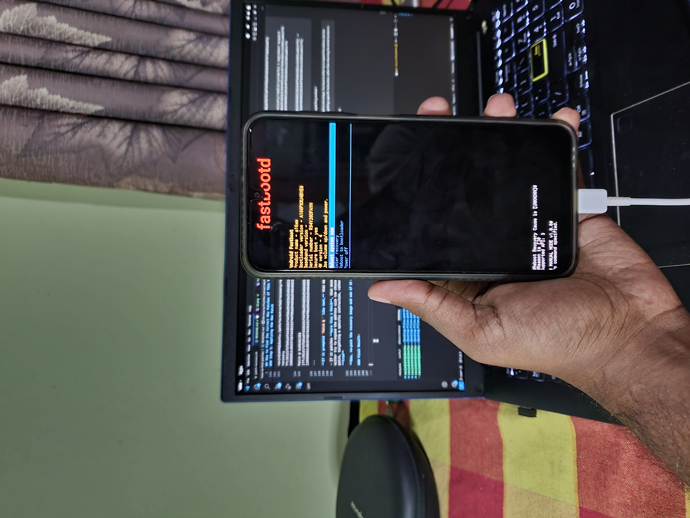

```
© 2025 @ravindu644. All rights reserved.

Unauthorized reproduction, distribution, or republication of this material, in whole or in part, is strictly prohibited without prior written permission from the author.
```

## How to Find the Correct Hex Patches if This Tool Doesn't Work for You


[](https://t.me/SamsungTweaks)

**Requirements:**  

- Knowledge of unpacking and repacking the `recovery.img` manually.  
    - Tools I suggest: [Android_boot_image_editor](https://github.com/cfig/Android_boot_image_editor), [AIK-Linux](https://github.com/SebaUbuntu/AIK-Linux-mirror)  
- A Linux PC.  
- [Ghidra](https://github.com/NationalSecurityAgency/ghidra) installed.

---

### 🟢 Method

### Step 1: Preparing

01. Unpack the `recovery.img` using your preferred tool.  
02. Go to the unpacked folder and search for a file named `recovery`.  

  
*This is the file we are looking for! (near the mouse cursor)*  

03. Copy that file to a new folder.  

---

### Step 2: Setting up a Ghidra Project

01. Go to your Ghidra folder and run it with `./ghidraRun`.  
02. Create a new project, and select that "new folder" as the project's folder.  
    - `File -> New Project`  

      
    *Creating a new project*    

03. Select your project, then go to `File -> Import File -> Select the recovery file we just extracted -> OK -> OK`.  

      

04. Now, right-click on the `recovery` file and select **Open in Default Tool**.  

      

05. Select **Yes** here:  

      

06. Click **Select All**, then press **Analyze**.  

      

07. This process will take some time to finish the analysis, so be patient!  

      

    - Click "Ok" if it gave any errors/warnings.  

---    

### Step 3: Finding what to patch !

01. Once the analysis is complete, the UI should look like this:  

      

02. On the left side of Ghidra, in the **Symbol Tree**, there’s a drop-down menu called **Functions**.  

      

03. Expand it and find the functions that start with a capital **I**.  

      

04. As you can see at the bottom of the screenshot above, there are two functions called:  
    - `isAllowFastbootdByCmdline`  
    - `isAllowFastbootdByProperty`  

**Our goal is to modify these functions so they always return `true`,** which will re-enable **fastbootd** mode!  


### Step 4: Finding the Hex Byte Sequence

01. First, let’s patch the `isAllowFastbootdByCmdline` function.  
02. Left-click once on the function name to select it.  

      

03. In the middle section of the UI, scroll until you find the first instruction set.  

      

    - The highlighted part is the first instruction set of that function.  

          

04. Now, we need to copy the original hex byte sequence!  

    - Click and hold at the beginning of the first instruction set, then drag the cursor down to select the following instructions until the **Listing** window says `(40 addresses selected)`.  

      

05. Right-click anywhere in the green highlighted area → **Copy Special** → **Byte String (no spaces)** → **OK**.  

    - Paste it into a text editor in a format that’s easy for you to read:  

      

**This is where the actual patching begins!**

06. Go back to Ghidra and move your cursor to the first instruction of the function.  

      

07. Right-click on it → select **Patch Instruction**.  

      

08. Modify the first value (in my case, `sub`) to `mov`, and change the right-hand part to `w0, #1`. Press **Enter**.  

    - It should now look like this:  
      

09. For the second instruction set, clear all the existing values and change it to `ret`.  
    - In my case, the original was `stp x29, x30, [sp, #local_50]`. I replaced `stp` with `ret`. Press **Enter**.  

    - The result should be like this:  
      

10. On the right side of Ghidra, you’ll now see that we’ve successfully modified the function to always return `true`.  

      

11. Next, copy the patched hex byte sequence.  

    - Repeat the same process from step **05**, and paste the patched values into your text editor:  

      

12. Repeat the entire process for the second function, `isAllowFastbootdByProperty`, and paste its patched values into the text editor as well.  

    - The final result should look like this:  

      

### Step 5: Applying the Hex Patch

01. The hard part is done. All that’s left is to apply the hex patches we saved in our text editor.  

    - You can safely close Ghidra now.   

02. Download the latest Magisk APK, extract it, and copy the `libmagiskboot.so` file from the `lib/x86_64/` folder.  
    - Rename it to `magiskboot`.  
    - Give it executable permissions with:  
      `chmod +x magiskboot`  
    - Add it to your PATH.  

03. Open a terminal in the folder where the original `recovery` binary is located inside the extracted `recovery.img`.  

    - For example, in my case:  
      `/home/ravindu644/Documents/boot_editor_v15_r1/build/unzip_boot/root/system/bin`  

04. To hex patch the `recovery` file to re-enable **fastbootd** mode using `magiskboot`, use this command format:  

    ```
    magiskboot hexpatch /path/to/file <original hex> <modified hex>
    ```

    **In our case:**  

    ```
    magiskboot hexpatch recovery <From> <To>
    ```

Here’s how I patched the `recovery` binary:  


```

ravindu644@ubuntu:/path/to/extracted/recovery/ramdisk/system/bin $ magiskboot hexpatch recovery ff4302d1fd7b04a9fd030191f92b00f9f85f06a9f65707a9f44f08a954d03bd589f9ffd0881640f9 20008052c0035fd6fd030191f92b00f9f85f06a9f65707a9f44f08a954d03bd589f9ffd0881640f9

Patch @ 0x0010C120 [ff4302d1fd7b04a9fd030191f92b00f9f85f06a9f65707a9f44f08a954d03bd589f9ffd0881640f9] -> [20008052c0035fd6fd030191f92b00f9f85f06a9f65707a9f44f08a954d03bd589f9ffd0881640f9]


ravindu644@ubuntu:/path/to/extracted/recovery/ramdisk/system/bin $ magiskboot hexpatch recovery ffc301d1fd7b05a9fd430191f44f06a954d03bd549048052881640f9e0630091e1030091a8831ff8 20008052c0035fd6fd430191f44f06a954d03bd549048052881640f9e0630091e1030091a8831ff8

Patch @ 0x0010C2E0 [ffc301d1fd7b05a9fd430191f44f06a954d03bd549048052881640f9e0630091e1030091a8831ff8] -> [20008052c0035fd6fd430191f44f06a954d03bd549048052881640f9e0630091e1030091a8831ff8]

```

**If it prompted `Patch @ ` like text,** that means our hex patching worked..!

> If it patches **more than 1 Patch**, that means, your patch is not unique. You have to either try to expand the address size (we choose to use 40), or make a more precise patch, targetting a specific instruction, rather than returning the whole function to **true**

**Now, re-pack the recovery image and see if it worked..!**

### Final Result:

  

---

> Now, you can apply your patches directly to the script via a PR, or create an issue about your patches in the proper format.
